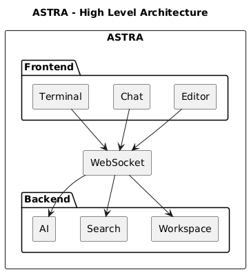

# Astra

Astra is a local-first AI development environment designed to bring code editing, workspace intelligence, semantic search, AI assistance, and terminal workflows into a single developer workspace.

It combines a code editor, AI chat, autocomplete, quick editing, semantic code search, workspace indexing, and an integrated terminal while keeping the development workflow close to the local machine.

## Overview

Astra consists of a web-based frontend and a Spring Boot backend.

The frontend provides the developer experience:

* Code editor
* File explorer
* AI chat
* Code autocomplete
* Quick edit
* Integrated terminal
* Workspace search
* Real-time workspace updates

The backend provides the intelligence and system integration:

* Workspace management
* File indexing
* Source-code parsing
* Symbol indexing
* Code embeddings
* Semantic search
* AI model integration
* Code editing operations
* Terminal process management
* WebSocket-based real-time communication

The architecture is designed around a local-first workflow where the developer's workspace remains the primary source of truth.

## Architecture

```text
                         ASTRA
                           |
              +------------+------------+
              |                         |
           Frontend                  Backend
              |                         |
      +-------+-------+        +--------+--------+
      |       |       |        |        |        |
   Editor   Chat   Terminal  Workspace Search    AI
      |       |       |        |        |        |
      +-------+-------+        +--------+--------+
              |                         |
              +------ WebSocket --------+
                        |
                  Real-time Events
```

## Frontend

The frontend is responsible for the developer-facing interface.

### Editor

The editor provides the primary code editing experience.

It communicates with the backend for:

* Code autocomplete
* Quick edits
* File updates
* Workspace information
* Symbol information

### AI Chat

The AI chat provides workspace-aware assistance.

The backend can use indexed source code, symbols, semantic search results, and workspace context to provide relevant answers.

AI responses can be streamed to the frontend through WebSocket events.

### Terminal

The integrated terminal allows developers to execute commands without leaving Astra.

The backend manages terminal processes while the frontend displays:

* Command input
* Standard output
* Standard error
* Process state
* Exit status

Terminal output is streamed to the frontend in real time.

### Workspace

The workspace provides access to project files and source-code information.

Astra indexes the workspace and maintains information about:

* Files
* File metadata
* Programming languages
* Source symbols
* Classes
* Interfaces
* Constructors
* Methods
* Embeddings

Changes made to the workspace can be propagated to the frontend through WebSocket events.

## Backend

The backend is implemented using Spring Boot.

It provides APIs and services for workspace management, code intelligence, AI functionality, terminal execution, and real-time communication.

### Workspace

The workspace subsystem manages the developer's project directory.

It handles:

* Workspace opening
* Workspace validation
* File discovery
* File metadata
* File changes
* Incremental indexing

A filesystem watcher detects changes made outside Astra and updates the internal index.

### Code Parsing

Astra uses Tree-sitter to analyze source code.

For Java source files, the parser extracts symbols such as:

* Classes
* Interfaces
* Constructors
* Methods

Each symbol contains its source location, allowing other parts of the system to retrieve the corresponding source context.

### Semantic Search

Astra generates vector embeddings for source-code symbols and stores them in a vector store.

Semantic search allows developers to search the codebase using natural language rather than relying only on exact symbol names.

For example:

```text
authentication logic
```

can locate relevant code even when the implementation does not contain the exact word "authentication".

Search results contain both semantic similarity information and source-code metadata.

## AI

Astra supports local AI models through Ollama.

Different models can be used for different tasks.

Example configuration:

```yaml
astra:
  embedding:
    ollama:
      base-url: http://localhost:11434
      model: nomic-embed-text

  llm:
    base-url: http://localhost:11434
    model: qwen2.5:1.5b
```

The embedding model is used for semantic code search.

The language model is used for tasks such as:

* AI chat
* Autocomplete
* Quick edits
* Code assistance

This architecture allows local models to be used without requiring cloud-based AI APIs.

## Autocomplete

Astra provides context-aware code completion.

The backend collects code surrounding the cursor and sends the context to the configured local language model.

The completion service is designed to return only the code that should be inserted into the editor.

The context includes:

* File path
* Cursor position
* Code surrounding the cursor
* Code immediately before the cursor
* Code immediately after the cursor

## Quick Edit

Quick Edit allows developers to select code and request an AI-generated modification.

The workflow is:

```text
Code Selection
      |
      v
AI Edit Request
      |
      v
Generated Modification
      |
      v
Diff
      |
      +---- Apply
      |
      +---- Reject
```

When changes are applied, the affected file is updated and the workspace index is refreshed.

This keeps symbols and embeddings synchronized with the source code.

## Terminal

Astra provides an integrated terminal backed by the operating system.

The backend manages terminal sessions and processes.

A terminal session contains:

* Session ID
* Working directory
* Running process
* Process state
* Standard output
* Standard error
* Exit status

Terminal output is streamed to connected clients so the UI can display command execution in real time.

## WebSocket

WebSocket provides real-time communication between the Astra frontend and backend.

The frontend maintains a WebSocket connection to receive events such as:

```text
Workspace events
File changes
Index updates
Terminal output
AI streaming tokens
AI stream completion
```

A typical event has the following structure:

```json
{
  "type": "INDEX_UPDATED",
  "timestamp": 1786293206452,
  "payload": {
    "filePath": "C:\\Users\\utsav\\Downloads\\sample_project\\UserService.java",
    "symbols": 4
  }
}
```

AI streaming events can contain:

```json
{
  "type": "AI_STREAM_TOKEN",
  "timestamp": 1786297120053,
  "payload": {
    "requestId": "25c05bfa-5172-4cb9-bc99-140b67ef2b7c",
    "token": "A Java constructor is a special method..."
  }
}
```

A stream completion event identifies the completed request:

```json
{
  "type": "AI_STREAM_COMPLETE",
  "timestamp": 1786297120053,
  "payload": {
    "requestId": "25c05bfa-5172-4cb9-bc99-140b67ef2b7c"
  }
}
```

The frontend can use the `requestId` to associate streamed responses with the correct chat or AI operation.

## Data Flow




## Local Development

### Requirements

* Java 17+
* Maven
* PostgreSQL with pgvector
* Ollama
* A local embedding model
* A local language model

### Start Ollama

```bash
ollama serve
```

Verify installed models:

```bash
ollama list
```

Example models:

```text
nomic-embed-text
qwen2.5:1.5b
```

### Start the Backend

```bash
mvn spring-boot:run
```

Or build the project:

```bash
mvn clean install
```

Then run the generated Spring Boot application.

## Configuration

Backend configuration can be provided through `application.yml`.

Example:

```yaml
spring:
  application:
    name: astra-backend

astra:
  embedding:
    ollama:
      base-url: http://localhost:11434
      model: nomic-embed-text

  llm:
    base-url: http://localhost:11434
    model: qwen2.5:1.5b
```

Frontend endpoints should be configured through environment variables rather than hardcoded backend URLs.

Example:

```text
VITE_API_URL=http://localhost:8080
VITE_WS_URL=ws://localhost:8080
```

## Design Principles

### Local First

Astra is designed to work primarily with locally available source code, models, and development tools.

### Workspace as the Source of Truth

The filesystem remains the authoritative source for project files.

Indexes, symbols, embeddings, and cached information are derived from the workspace.

### Incremental Processing

File changes should update only the affected parts of the workspace rather than requiring a complete re-index.

### Context-Aware AI

AI operations should use relevant workspace and code context rather than relying only on the user's prompt.

### Frontend


### Real-Time Updates

The frontend should remain synchronized with backend activity through WebSocket events.

### Modular Architecture

Workspace management, parsing, indexing, embeddings, AI, terminal execution, and WebSocket communication are separated into independent backend components.

## Current Use Case

Astra is intended to provide a single environment where a developer can:

1. Open a local project.
2. Browse and edit source files.
3. Search the codebase semantically.
4. Ask questions about the code.
5. Receive AI-powered autocomplete suggestions.
6. Apply AI-generated code changes.
7. Execute commands in an integrated terminal.
8. Receive workspace and AI updates in real time.

The goal is to combine traditional developer tooling with local AI capabilities while keeping the development workflow fast, contextual, and close to the developer's workspace.
